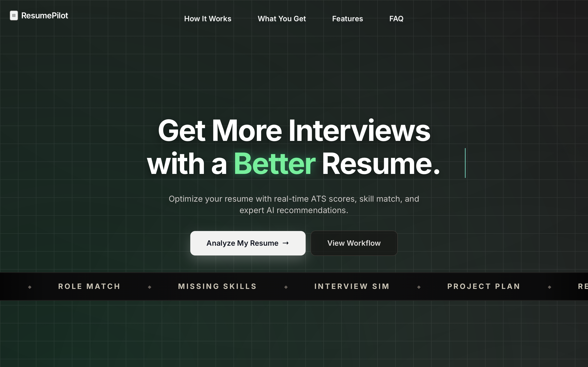
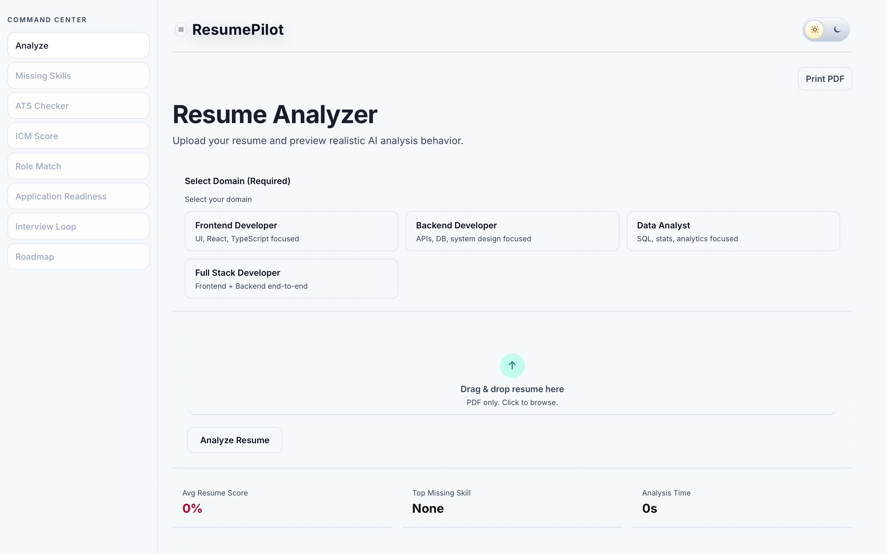
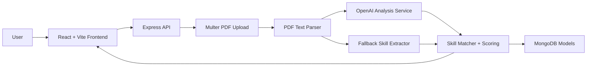
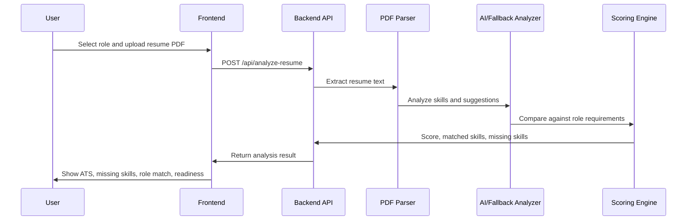
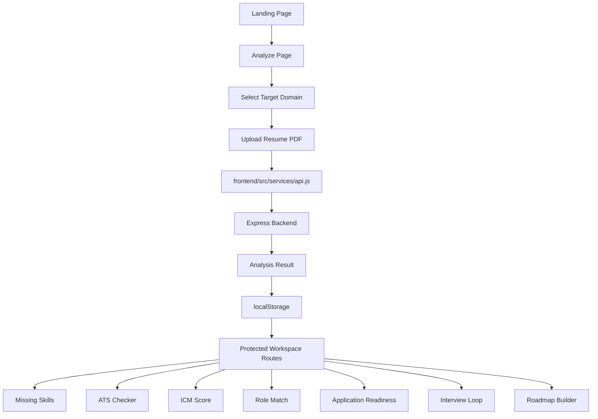
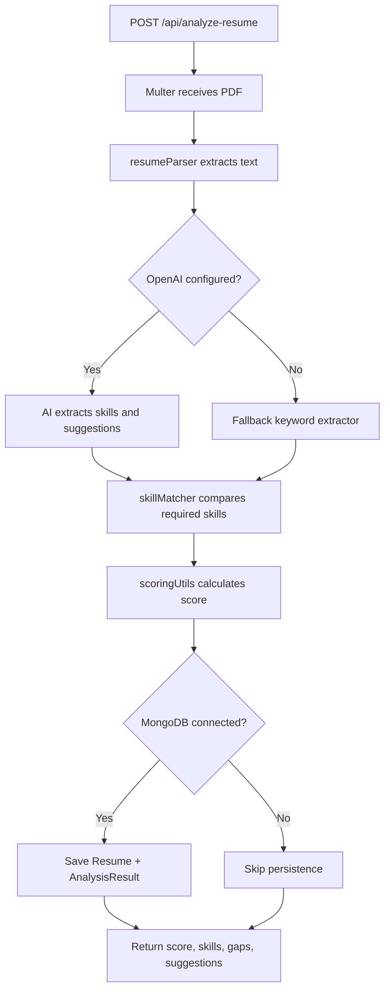
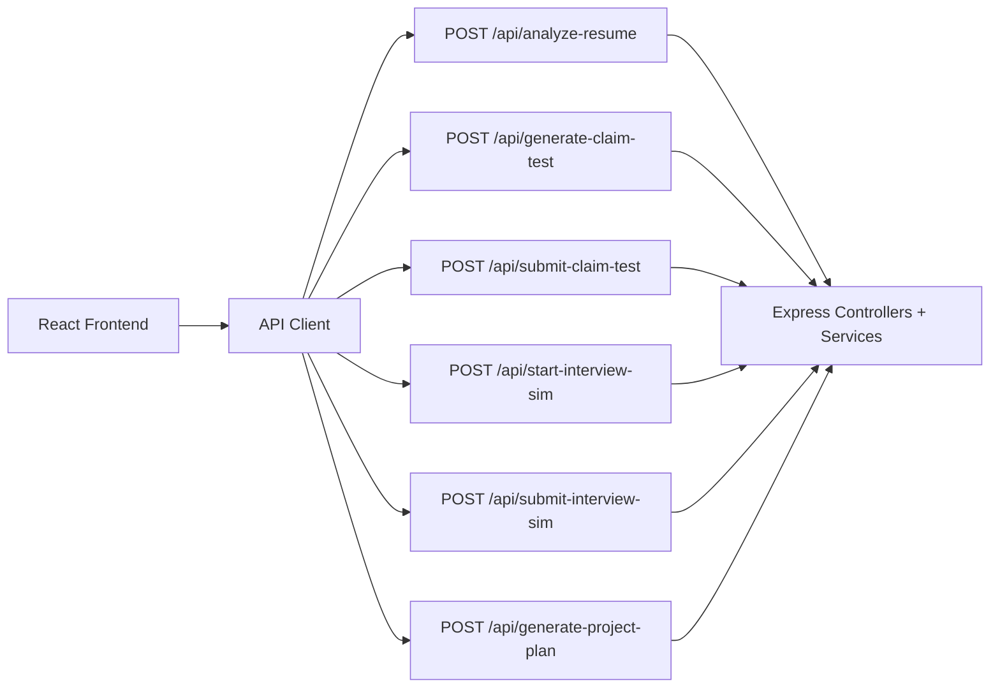

# ResumePilot - AI Resume Analyzer

ResumePilot is a full-stack resume analysis platform that helps job seekers improve their resumes before applying. It combines PDF parsing, AI-assisted skill extraction, ATS-style scoring, missing-skill detection, role matching, interview preparation, and a practical roadmap builder in one workspace.

The product is designed around a simple workflow: upload a PDF resume, choose a target domain, review the score and skill gaps, then use the generated recommendations to make the resume more recruiter-ready and interview-ready.

## Product Screenshots

### Landing Page



The landing page presents ResumePilot as an interview-focused resume optimization tool. It highlights the core promise: more interviews through a better resume. The hero section communicates the main value clearly: real-time ATS scores, skill matching, and AI recommendations. The workflow strip below the hero previews the major product modules, including Role Match, Missing Skills, Interview Simulation, and Project Plan.

### Analyzer Dashboard



The analyzer dashboard is the command center for the product. Users select a target domain such as Frontend Developer, Backend Developer, Data Analyst, or Full Stack Developer, then upload a PDF resume for analysis. The left sidebar shows the major analysis modules: Missing Skills, ATS Checker, ICM Score, Role Match, Application Readiness, Interview Loop, and Roadmap. The top metrics show resume score, top missing skill, and analysis time after a scan is completed.

## Core Features

### Resume Upload and AI Analysis

Users upload a PDF resume and select a target role/domain. The backend extracts text from the PDF, sends the resume content to the AI analysis service when an OpenAI key is available, and falls back to deterministic skill extraction when AI is not configured. The response includes extracted skills, matched skills, missing skills, a resume score, and improvement suggestions.

### Missing Skills Detection

The Missing Skills module compares the candidate's extracted resume skills with the selected role requirements. For example, a Backend Developer profile is checked against skills such as Node, Express, MongoDB, SQL, and System Design. The result tells users exactly which important skills are already present and which ones should be added through projects, experience bullets, or certifications.

### ATS Checker

The ATS Checker helps estimate how cleanly the resume can be understood by applicant tracking systems. It focuses on keyword alignment, section clarity, role relevance, and resume structure. The dashboard turns this into a practical checklist so users can improve the resume before submitting applications.

### ICM Weighted Score

ICM scoring combines multiple hiring signals into one weighted score:

- Skill match: 40%
- Experience strength: 25%
- Project depth: 20%
- ATS keyword alignment: 15%

This gives users a more balanced readiness score than a simple keyword count.

### Role Match

Role Match compares the resume against a selected job role or job description context. It helps users understand whether their resume is positioned for Frontend Developer, Backend Developer, Data Analyst, or Full Stack Developer paths. It also highlights role-specific missing skills and alignment gaps.

### Resume Claim Verification

ResumePilot can generate a skill-claim test from the uploaded resume. The system creates questions based on claimed skills, evaluates the user's answers, and produces an authenticity score. This helps check whether resume claims are backed by practical knowledge.

### Interview Loop

The Interview Loop creates company and role-specific interview simulations. It includes technical basics, applied scenarios, and debugging/decision questions. After the user answers, the system returns round-level scores and a readiness recommendation.

### Application Readiness

Application Readiness brings together resume score, missing skills, ATS health, role alignment, and interview signal. It gives users a final view of whether they are ready to apply or should improve specific weak areas first.

### Roadmap Builder

The Roadmap Builder turns missing skills into an action plan. It can generate a project blueprint with milestones, deliverables, and resume bullet ideas so the user knows how to close gaps in a practical, portfolio-friendly way.

## System Architecture



## Product Flow



## Tech Stack

| Layer | Technology |
| --- | --- |
| Frontend | React 19, Vite, React Router, Tailwind CSS, Framer Motion |
| UI/Visuals | Lucide React, GSAP, Lenis, Three.js / React Three Fiber |
| Backend | Node.js, Express 5 |
| Uploads | Multer |
| PDF Parsing | pdf-parse |
| AI | OpenAI Responses API with fallback extraction |
| Database | MongoDB with Mongoose |
| Deployment | Vercel frontend, Render backend |

## Frontend Explanation

The frontend lives in `frontend/` and is responsible for the complete user experience: landing page, resume upload, dashboard navigation, analysis views, theme switching, export actions, and the protected workspace flow after a resume is analyzed.

### Frontend Responsibilities

- Render the public landing page with product positioning and calls to action.
- Let users choose a target domain before uploading a resume.
- Upload PDF resumes to the backend through `FormData`.
- Store analysis results in browser `localStorage` so workspace pages can reuse the latest scan.
- Show ATS, missing skills, ICM score, role match, readiness, interview loop, and roadmap pages.
- Call backend APIs for resume analysis, claim verification, interview simulation, and project-plan generation.
- Provide a responsive dashboard layout with sidebar navigation and light/dark theme support.

### Important Frontend Files

| File | Purpose |
| --- | --- |
| `frontend/src/App.jsx` | Main routed application. Contains landing page, analyzer page, protected workspace pages, theme state, local analysis state, and route definitions. |
| `frontend/src/services/api.js` | API client for backend calls. Handles API base URL selection, local fallback, request timeouts, and JSON error handling. |
| `frontend/src/lib/scoring.js` | Frontend scoring helpers for weighted ICM scoring and analysis-duration formatting. |
| `frontend/src/components/PremiumLanding.jsx` | Alternative animated landing component using GSAP, Lenis, Three.js, and React Three Fiber. |
| `frontend/src/components/ui/button.jsx` | Shared button primitive used across the interface. |
| `frontend/src/index.css` | Global styles and Tailwind-driven visual system. |
| `frontend/docs/screenshots/` | Product screenshots used by this README. |

### Frontend Pages and Views

| View | What It Does |
| --- | --- |
| Landing Page | Explains the product promise and routes users into the analyzer flow. |
| Analyze Page | Lets users select a domain, upload a PDF, run analysis, and view top-level metrics. |
| Missing Skills | Shows role-specific skill gaps and suggested next steps. |
| ATS Checker | Displays ATS-readiness checks around keywords, structure, and readability. |
| ICM Score | Combines skill match, experience, project depth, and ATS keyword alignment into a weighted score. |
| Role Match | Compares the resume against role expectations or job-description context. |
| Application Readiness | Summarizes whether the candidate is ready to apply based on resume and interview signals. |
| Interview Loop | Uses backend interview simulation APIs to test role readiness. |
| Roadmap Builder | Builds a practical improvement roadmap from missing skills and selected target role. |

### Frontend State Flow



## Backend Explanation

The backend lives in `backend/` and provides the resume analysis API. It accepts PDF uploads, extracts resume text, performs AI or fallback skill extraction, computes skill matches and scores, optionally stores results in MongoDB, and powers advanced workflows such as claim verification, interview simulation, and project roadmap generation.

### Backend Responsibilities

- Start an Express server and expose `/health` plus `/api/*` routes.
- Accept PDF uploads through Multer memory storage.
- Extract text from uploaded resumes with `pdf-parse`.
- Analyze resume text with OpenAI when `OPENAI_API_KEY` is available.
- Use fallback keyword extraction when AI is unavailable.
- Compare extracted skills with role-required skills.
- Calculate resume score from matched vs required skills.
- Persist resume and analysis results when MongoDB is connected.
- Generate skill-claim tests, evaluate answers, and create company shortlists.
- Generate interview simulations and evaluate interview readiness.
- Generate project blueprints that help users close missing-skill gaps.

### Important Backend Files

| File | Purpose |
| --- | --- |
| `backend/server.js` | Express app entry point. Loads environment variables, connects MongoDB, mounts routes, and starts the server. |
| `backend/routes/resumeRoutes.js` | Defines all resume, assessment, interview, and project-plan API routes. |
| `backend/controllers/resumeController.js` | Main request handlers for analysis, LinkedIn-like parsing, claim tests, interview simulations, and project plans. |
| `backend/middleware/uploadMiddleware.js` | Multer configuration for accepting uploaded resume PDFs. |
| `backend/services/resumeParser.js` | Extracts text from uploaded PDF buffers. |
| `backend/services/openaiService.js` | Runs AI resume analysis and project blueprint generation, with fallback behavior. |
| `backend/services/skillMatcher.js` | Compares extracted resume skills against required role skills. |
| `backend/services/assessmentService.js` | Creates claim verification tests, company shortlists, and interview simulations. |
| `backend/services/linkedinParser.js` | Parses LinkedIn-like profile text for profile analysis. |
| `backend/utils/scoringUtils.js` | Calculates score from matched and required skills. |
| `backend/config/db.js` | Connects to MongoDB using `MONGO_URI`. |
| `backend/config/openai.js` | Configures the OpenAI client. |

### Backend Models

| Model | Stored Data |
| --- | --- |
| `Resume` | Original extracted resume text, extracted skills, and upload timestamp. |
| `AnalysisResult` | Resume score, matched skills, missing skills, suggestions, and linked resume ID. |
| `CandidateAssessment` | Claim verification test ID, claimed skills, authenticity score, claim status, and shortlist results. |

### Backend Analysis Pipeline



### Frontend and Backend Contract

The frontend communicates with the backend through `frontend/src/services/api.js`. `VITE_API_BASE_URL` is used when provided, and the frontend falls back to `http://localhost:5000/api` for local development. Resume uploads use `multipart/form-data`, while interview, claim-test submission, and roadmap generation use JSON requests.



## Main API Routes

| Method | Route | Purpose |
| --- | --- | --- |
| `GET` | `/health` | Backend health check |
| `POST` | `/api/analyze-resume` | Upload PDF and return score, skills, gaps, and suggestions |
| `POST` | `/api/parse-linkedin-profile` | Analyze LinkedIn-like profile text |
| `POST` | `/api/generate-claim-test` | Generate a skill verification test from resume claims |
| `POST` | `/api/submit-claim-test` | Evaluate skill verification answers |
| `POST` | `/api/start-interview-sim` | Start a role/company interview simulation |
| `POST` | `/api/submit-interview-sim` | Evaluate interview simulation answers |
| `POST` | `/api/generate-project-plan` | Generate a gap-closing project roadmap |

## Project Structure

```text
ai-resume-analyzer/
  backend/
    config/              # OpenAI and MongoDB configuration
    controllers/         # API request handlers
    middleware/          # File upload middleware
    models/              # MongoDB schemas
    routes/              # Express routes
    services/            # AI analysis, parsing, skill matching, assessments
    utils/               # Scoring helpers
  frontend/
    docs/screenshots/    # README screenshots
    src/
      components/        # UI components
      lib/               # Frontend scoring helpers
      services/          # API client
      App.jsx            # Main routed application
  DEPLOY_RENDER.md       # Render + Vercel deployment guide
  render.yaml            # Render backend blueprint
```

## Local Setup

### Backend

```bash
cd backend
npm install
```

Create `backend/.env`:

```env
PORT=5000
MONGO_URI=your_mongodb_connection_string
OPENAI_API_KEY=your_openai_api_key
```

Start the backend:

```bash
npm run dev
```

If `MONGO_URI` is missing, the backend starts without database persistence. If `OPENAI_API_KEY` is missing or the AI request fails, ResumePilot uses fallback skill extraction.

### Frontend

```bash
cd frontend
npm install
```

Create `frontend/.env` if the backend is not running on the default local URL:

```env
VITE_API_BASE_URL=http://localhost:5000/api
```

Start the frontend:

```bash
npm run dev
```

## Testing and Build

```bash
cd frontend
npm test
npm run build
```

## Deployment

The intended deployment setup is:

- Backend on Render using `render.yaml`
- Frontend on Vercel with root directory set to `frontend`
- `VITE_API_BASE_URL` pointing to the Render API URL

Detailed deployment steps are available in `DEPLOY_RENDER.md`.

## Why ResumePilot Matters

Most resume tools only give a generic score. ResumePilot is built around the actual job search workflow: identify missing skills, improve ATS alignment, verify claimed skills, prepare for interviews, and create a roadmap that turns weak areas into portfolio proof.
